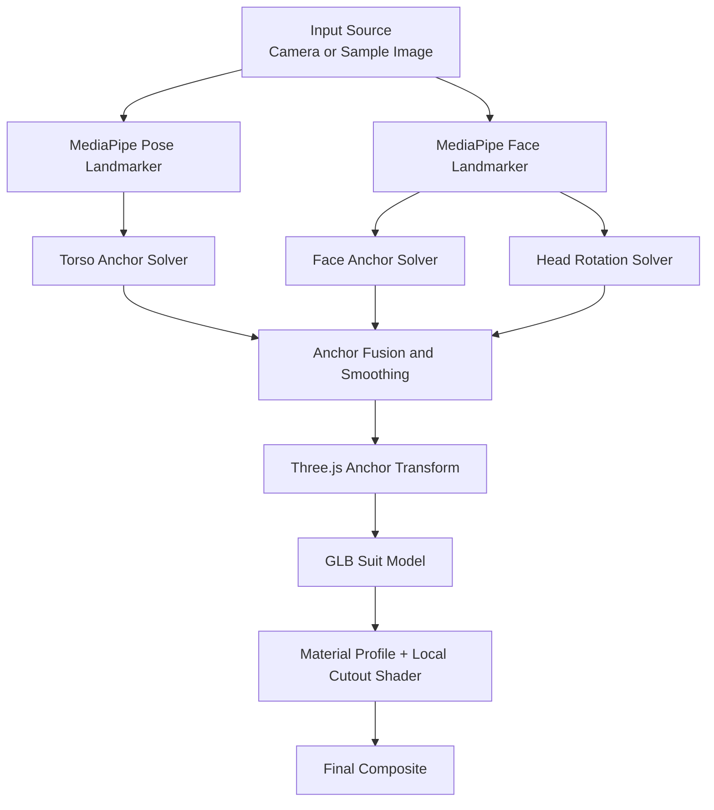
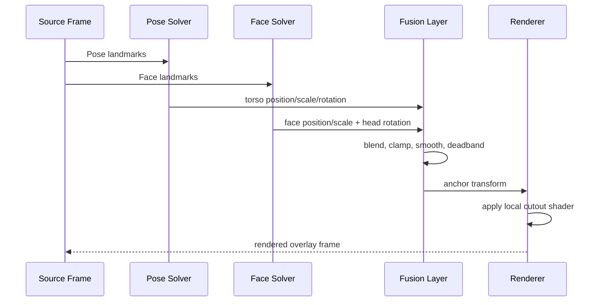

# Lobster Face Filter: Conceptual Guide

This project solves a common AR filter problem: a 3D suit/helmet model tends to hide the real face, jitter under imperfect tracking, and drift when the subject turns or reframes.

The approach here is a **hybrid tracking + local shader cutout pipeline**:

- Pose landmarks keep the model body aligned and stable.
- Face landmarks keep the face window aligned to the real face.
- A mesh-local ellipsoid cutout in shader space creates a controlled face-through area.
- Smoothing, clamping, and fallback logic keep behavior stable in noisy frames.

This README explains the concepts behind that solution and how the system fits together.

## GitHub Pages Hosting

The repository is set up to publish a project site through GitHub Pages using
`.github/workflows/deploy-pages.yml`.

- Local development should continue to use `npm run dev`.
- GitHub Pages builds should use `npm run build:pages`.
- Public assets are resolved through Vite's base URL so `/models/...` and
similar files still load when the site is hosted under `/obs-face-filter/`.
- Hosted links should prefer query parameters such as `?model=bowling-hat` and
`?sample=sample-1` instead of deep paths like `/samples/sample-1`, because
GitHub Pages does not natively rewrite arbitrary route-like URLs.

## What Problem Is Being Solved

The "lobster filter problem" in this repo is not just "attach a model to a person." It is a multi-part alignment problem:

1. The suit should follow torso movement naturally.
2. The face opening should stay centered on the user's face as head orientation changes.
3. The user should still be visible through the opening (without globally making the whole model translucent).
4. Tracking should fail gracefully when landmarks are noisy, partially visible, or temporarily lost.

The implementation treats those as separate subproblems and solves each with dedicated logic.

## High-Level Architecture

Core idea: **pose gives stable body context**, **face gives precise face alignment**, and **cutout shader gives local pass-through**.

## Core Concepts

### 1) Dual-Landmarker Tracking Strategy

The system runs both:

- **Pose tracking** for shoulders/hips (body position, body scale, torso roll).
- **Face tracking** for eye/nose landmarks (face center, eye-distance scale, head yaw/pitch/roll).

Why this matters:

- Pose is better for full-body stability.
- Face is better for front opening alignment.
- Combining both is significantly more robust than either alone.

### 2) Separate Anchors for Body and Face

Two logical anchors are derived each frame:

- **Torso anchor** from shoulder/hip geometry.
- **Face anchor** from eye midpoint blended toward nose tip.

Then the runtime blends these anchors into one transform target. In sample image mode, behavior is more face-dominant; in camera mode, blending balances body stability and face precision.

### 3) Cutout-Centered Alignment (Not Origin-Centered)

A major fix in this repo is that alignment is based on the **actual cutout center** on the model, not the model origin.

Conceptually:

1. Resolve the primary cutout's local center on the mesh.
2. Convert that to an anchor-local offset.
3. During tracking, place the anchor so this cutout center lands on the detected face point.

This avoids the classic issue where the suit appears "mostly right" but the face opening drifts off-center.

### 4) Localized Face-Through via Shader Cutout

Instead of reducing opacity for the entire suit, a shader patch applies an **ellipsoid signed-distance cutout** in mesh-local space.

- Inside cutout: alpha fades down (face shows through).
- Outside cutout: normal suit opacity/material behavior.
- Feather value softens edge transitions to avoid hard seams.

This gives controlled pass-through only where needed.

## Frame Pipeline

Per-frame decisions are intentionally conservative to avoid visible jitter.

## Stability and Robustness Techniques

The solved behavior relies on multiple guardrails working together:

- **Confidence gating**: unreliable landmarks are ignored.
- **Synthetic hip fallback**: torso estimate still works when hips are out of frame.
- **Eye-distance minimum threshold**: prevents unstable face scale at tiny detections.
- **Asymmetric smoothing** for face scale: scale-up can react faster than scale-down.
- **Deadbands** on position and rotation: tiny fluctuations do not move the model every frame.
- **Blend clamping** between torso and head rotation: head influence is limited to plausible deltas.
- **Pose-loss grace window**: model does not disappear immediately on brief detection drops.

Together these produce a stable overlay that still feels responsive.

## Scale Strategy

Scale is not one-size-fits-all:

- **Torso-driven scale** from shoulder width + torso length keeps body fit stable.
- **Face-driven scale** from eye distance keeps the face opening proportional.
- **Geometry-aware face scale** (using cutout window width) maps measured eye distance to the actual model opening size.
- Final scale is blended and clamped per mode (camera vs sample).

This is a key reason the opening fit remains believable across different subject sizes and framing distances.

## Material/Profile System (Conceptual)

The rendering profile has three conceptual layers:

1. **Base tuning**: global defaults for all materials.
2. **Matcher-based overrides**: targeted changes for likely face-adjacent parts.
3. **Cutout definitions**: local face-through windows in mesh space.

Overrides are designed to be data-driven so tuning can happen without changing core tracking logic.

## Debug-First Tuning Workflow

The repository includes an explicit tuning workflow used to reach the current solution:

- Dump mesh/material catalogs to identify stable matcher terms.
- Enable cutout debug helpers (wireframe ellipsoid + center marker).
- Drag cutout center directly on mesh surface to align opening.
- Adjust radii/feather live and copy resulting JSON.
- Validate across multiple sample frames and live camera.

This avoids trial-and-error blind edits and turns alignment into an observable process.

## Coordinate Space Strategy

One subtle but important concept is consistent coordinate handling:

- Landmarks are transformed into normalized device coordinates for anchoring.
- Sample-image mode accounts for object-fit containment and letterboxing.
- World-space target points are solved on a fixed anchor plane in front of camera.
- Cutout itself is authored and evaluated in mesh-local space.

Each stage uses the coordinate space that is most stable for that task.

## Why This Works Well in Practice

The solution is effective because it does not rely on a single trick. It combines:

- robust body anchoring,
- precise face-centric correction,
- physically meaningful cutout-based alignment,
- local shader transparency,
- and practical calibration tooling.

That combination addresses the full lobster filter problem: **alignment, visibility, stability, and maintainability**.

## Mental Model for Future Changes

When extending the system, keep this separation of concerns:

- Tracking quality issues -> improve anchor solvers, confidence handling, smoothing.
- Face visibility issues -> tune cutout geometry/shader/profile.
- Material appearance issues -> tune profile overrides and render flags.
- Environment-specific behavior -> tune mode-specific constants and projection mapping.

Treat these layers independently, and integration remains predictable.